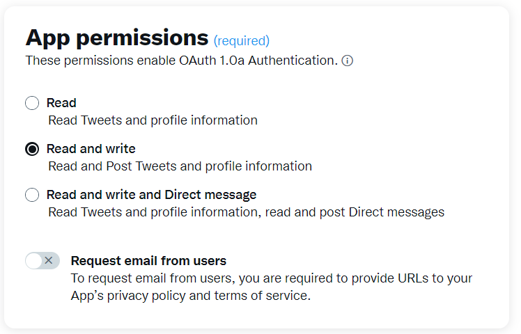
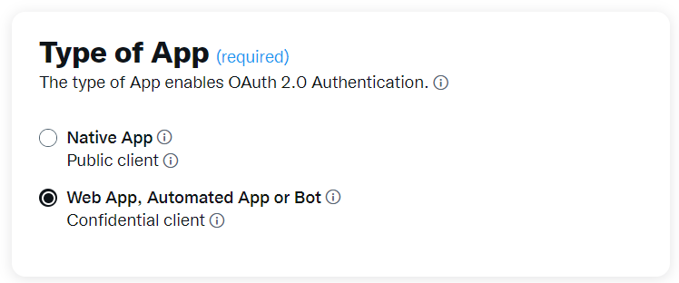

# Webs crapping project

## Junia HEI 2022
## General 
Each file.py corresponds to an exercise

Get started:
`ex1.py` & `ex2.py` are using `selenium.webdriver.Chrome` 

To make the run the code you need to add the chromedriver.exe corresponding to your version of chrome
https://chromedriver.chromium.org/downloads  
Next You have to specify the path inside the `Chrome()` object. By default, it is set same dir.

The result of the data scrap are store inside a `result` folder
## Part 1 : Scrapping Steam
In this project, you'll get a chance to explore scraping data from Steam. We'll get you started with 
importing the packages you'll need and connecting to a sample webpage on the site 
(https://store.steampowered.com/tags/en/Action/). 
Use “lxml” parser with BS4

**1.** Try extracting the names of the top games from this page.
`result/exo1/games_info.csv`

**2.** What tags contain the prices? Can you extract the price information?  
`result/exo1/games_info.csv`

**3.** Get all the header tags on the page.  
`result/exo1/header_tags.html`

**5.** Under the "Narrow by Tag" section, there are a collection of tags (e.g. "Indie", "Adventure", etc.). 
Write code to return these tags.
`result/exo1/narrow_by_tag.txt`

**6.** What else can be scraped from this webpage or others on the site?


## Part 2: Scrapping Youtube

As a practice, you can have fun trying to scrape YouTube. Use the html parser with BS4

**1.** Scrape the text from each span tag  
`result/exo2/span.txt`

**2.** How many images are on YouTube'e homepage?  
`print` in console

**3.** Can you find the URL of the link with title = "Movies"? Music? Sports?  
`result/exo2/links.csv`

**4.** Now, try connecting to and scraping 
https://www.youtube.com/results?search_query=stairway+to+heaven

**a)** Can you get the names of the first few videos in the search results?
`result/exo2/titles.txt`

**b)** Next, connect to one of the search result videos -
https://www.youtube.com/watch?v=qHFxncb1gRY

**c)** Can you find the "related" videos? What are their titles? Durations? URLs? Number of views?  
`result/exo2/related.csv`

**d)** Try finding (and scraping) the description of the video  
`print` in console

## Part 3 Scrap twitter.com with api
Login/Authenticate to websites using Requests only (twitter.com),
you need to understand how authentication works, what are the steps you
need to authenticate all of your requests and finally you're going to write codes
to : (use : from lxml import html
From fake_useragent import UserAgent)

**Global:**
As mention in the description above, we will need to use `tweepy` https://github.com/tweepy/tweepy  
The credentials are stored inside a `.env` config file.
To get the credentials, follow the few steps:

- Register to the twitter developper program: https://developer.twitter.com/en
- Edit the User authentication set up
  
  
  
- Create a project
- Elevated the project (otherwise it won't work)
- Generate all credentials

Once all this is done you can replace inside the `.env` by your own credentials:  
You can install it by using: 
`pip install python-dotenv`
```
api_key = "YOUR API KEY"     
api_key_secret = "YOUR API SECRET"
acces_token = "YOUR ACCES TOKEN"
acces_token_secret = "YOUR ACCES TOKEN SECRET"
bearer_token = "YOUR BEARER TOKEN"
```

**1.** Scrape Emmanuel Macron first tweet.  
`result/exo3/last_tweet_macron.txt`

**2.** Collect real time messages stream (Bonus) (use tweepy module + api)
`result/exo3/tweets.txt`

**3.** Collect messages with hashtag (Bonus) (use tweepy module + api)  
Result are in same file: `result/exo3/tweets.txt`  
The only difference is in the rule that we set with:
`streaming_client.add_rules(tweepy.StreamRule("String with your keyword"))`

**demo**  (asset/demo_ex3.mp4)  

## Tech Stack

**Python:** selenium.webdriver, bs4, tweepy, dotenv 


## Authors

- [@Mapoe0](https://github.com/mapoe0/)
- [@emmabgmn](https://gitlab.com/emmabgmn)

